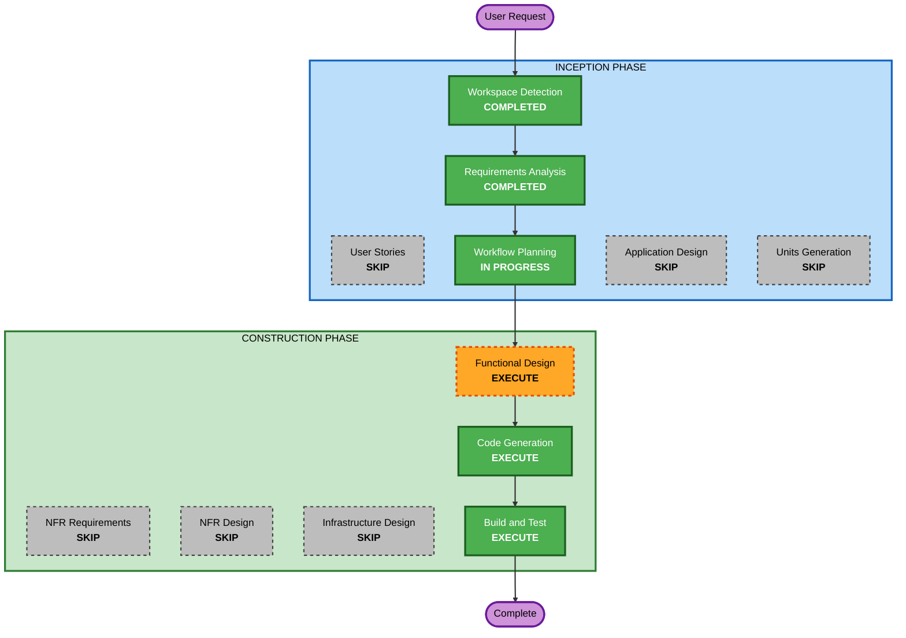

# Execution Plan — LLM Wiki MCP Service

## Detailed Analysis Summary

### Change Impact Assessment
- **User-facing changes**: Yes — 신규 MCP 도구 2개(search, read)가 LLM 클라이언트에 노출됨
- **Structural changes**: Yes — 신규 프로젝트 구조 생성 (그린필드)
- **Data model changes**: No — 데이터는 파일 시스템의 .md 파일, 별도 스키마 없음
- **API changes**: Yes — MCP 도구 인터페이스 신규 정의 (Streamable HTTP endpoint)
- **NFR impact**: Low — 소규모(수십 개 문서), 무인증 내부망, 인덱스 불필요

### Risk Assessment
- **Risk Level**: Low — 신규 독립 서비스, 기존 시스템 영향 없음, 읽기 전용
- **Rollback Complexity**: Easy — 서버 중지만으로 롤백 완료
- **Testing Complexity**: Simple — 순수 함수 중심 검색 로직 + MCP 도구 통합 테스트

## Workflow Visualization

### Mermaid Diagram



### Text Alternative

```
INCEPTION PHASE
- Workspace Detection ........ COMPLETED
- Reverse Engineering ........ N/A (greenfield)
- Requirements Analysis ...... COMPLETED
- User Stories ............... SKIP
- Workflow Planning .......... IN PROGRESS (this document)
- Application Design ......... SKIP
- Units Generation ........... SKIP

CONSTRUCTION PHASE (single unit: mcp-wiki-server)
- Functional Design .......... EXECUTE
- NFR Requirements ........... SKIP
- NFR Design ................. SKIP
- Infrastructure Design ...... SKIP
- Code Generation ............ EXECUTE (Planning + Generation)
- Build and Test ............. EXECUTE

OPERATIONS PHASE
- Operations ................. PLACEHOLDER
```

## Phases to Execute

### 🔵 INCEPTION PHASE
- [x] Workspace Detection (COMPLETED)
- [x] Requirements Analysis (COMPLETED)
- [x] User Stories (SKIPPED)
  - **Rationale**: 단일 페르소나(LLM 클라이언트), 읽기 전용 단순 도구, Q&A로 요구사항 명확화 완료
- [x] Workflow Planning (IN PROGRESS — this document)
- [ ] Application Design — SKIP
  - **Rationale**: 단일 소형 컴포넌트(모듈 2~3개). 컴포넌트 간 의존성 설계가 불필요하며, 검색 엔진 추상화 등 설계 결정은 Functional Design에서 충분히 다룸
- [ ] Units Generation — SKIP
  - **Rationale**: 단일 유닛(mcp-wiki-server)으로 분해 불필요

### 🟢 CONSTRUCTION PHASE (Unit: mcp-wiki-server)
- [ ] Functional Design — EXECUTE
  - **Rationale**: 검색/snippet 추출 로직, 시맨틱 검색 확장을 위한 검색 엔진 추상화 구조, MCP 도구 인터페이스 정의 필요. PBT-01 속성 식별(advisory) 포함
- [ ] NFR Requirements — SKIP
  - **Rationale**: 기술 스택 이미 확정(Python 3.12 + uv + FastMCP + Hypothesis, requirements.md NFR-4), NFR도 requirements.md에 문서화 완료. PBT-09 준수 확인됨
- [ ] NFR Design — SKIP
  - **Rationale**: NFR Requirements 생략에 따라 생략
- [ ] Infrastructure Design — SKIP
  - **Rationale**: 내부망/로컬 실행 단일 프로세스 서버, 클라우드 인프라 없음
- [ ] Code Generation — EXECUTE (ALWAYS)
  - **Rationale**: Part 1 계획 수립 → Part 2 코드/테스트 생성
- [ ] Build and Test — EXECUTE (ALWAYS)
  - **Rationale**: 빌드/테스트 실행 지침 생성 및 검증 (PBT-08 시드 로깅 포함)

### 🟡 OPERATIONS PHASE
- [ ] Operations — PLACEHOLDER
  - **Rationale**: 향후 배포/모니터링 워크플로우용

## Extension Rule Compliance (this stage)
| Rule | Status | Rationale |
|---|---|---|
| Security Baseline (all) | N/A | 확장 비활성 (opt-out) |
| PBT-02/03/07/08 | N/A | 계획 단계 — 코드 생성/테스트 단계에서 적용 |
| PBT-09 | Compliant | Hypothesis 프레임워크 선정, requirements.md NFR-4에 문서화 |

## Estimated Timeline
- **Total Stages Remaining**: 3 (Functional Design → Code Generation → Build and Test)
- **Estimated Duration**: 1~2 세션 (소규모 프로젝트)

## Success Criteria
- **Primary Goal**: 지정 디렉토리의 .md 파일을 검색/조회하는 MCP 서버 (Streamable HTTP) 가동
- **Key Deliverables**:
  - uv 기반 Python 3.12 프로젝트 (pyproject.toml)
  - FastMCP 서버 — `search`, `read` 도구 2개
  - pytest + Hypothesis 테스트 (PBT Partial 규칙 준수)
  - 빌드/실행/테스트 지침 문서
- **Quality Gates**:
  - path traversal 차단 검증
  - 검색 결과 snippet + 경로 형식 검증
  - PBT-02/03/07/08 준수 (해당 시)
